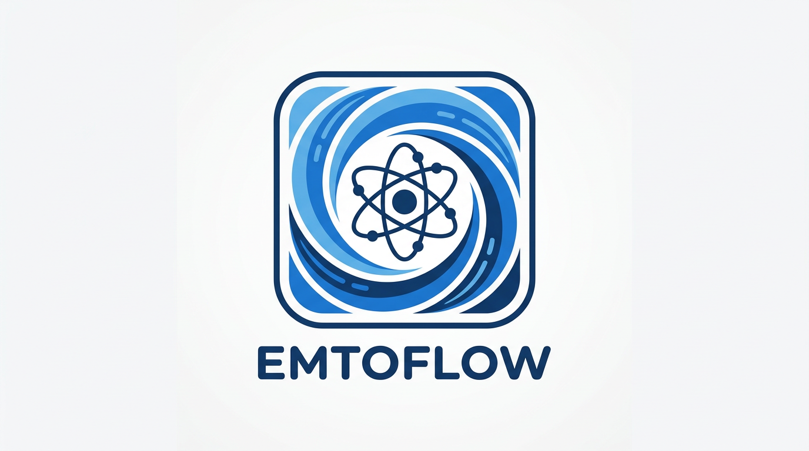

# EMTOFlow



Python toolkit for automating EMTO (Exact Muffin-Tin Orbitals) input file generation and optimization workflows for electronic structure calculations. This toolkit targets the **Lyngby version** of the EMTO code; for the method and code, see [Ruban and Dehghani, *Phys. Rev. B* **94**, 104111 (2016)](https://journals.aps.org/prb/abstract/10.1103/PhysRevB.94.104111).

---

## Overview

EMTO requires multiple input files (KSTR, SHAPE, KGRN, KFCD) for each calculation. This toolkit:
- Generates all input files from CIF structures or lattice parameters
- Automates c/a ratio and volume (SWS) optimization workflows
- Supports both ordered structures and random alloys (CPA)
- Provides equation of state fitting and analysis
- Generates SLURM job scripts for HPC clusters

---

## Key Features

- ✅ **Automatic input generation** from CIF files or lattice parameters
- ✅ **Complete optimization workflow** - c/a + SWS optimization with EOS fitting
- ✅ **Alloy support** - CPA random alloys (binary/ternary) and ordered intermetallics
- ✅ **All 14 EMTO lattice types** - Auto-detection from CIF or manual specification
- ✅ **DMAX optimization** - Automatic cutoff distance optimization
- ✅ **K-point rescaling** - Maintains constant reciprocal-space density across structures
- ✅ **Smart defaults** - Auto-generates c/a ratios and SWS values from structure
- ✅ **SLURM integration** - Serial and parallel job script generation
- ✅ **YAML configuration** - Reproducible workflows with configuration files

---

## Installation

### Option 1: Install as a library (recommended)

```bash
pip install git+https://github.com/pcostacarvalho/emtoflow.git
```

After installation you can:

- Use the **CLI**:

  ```bash
  emtoflow-opt path/to/config.yaml
  emtoflow-generate-percentages path/to/master_config.yaml
  ```

- Or the **Python API**:

  ```python
  from emtoflow import OptimizationWorkflow, load_and_validate_config

  config = load_and_validate_config("config.yaml")
  workflow = OptimizationWorkflow(config="config.yaml")
  results = workflow.run()
  ```

### Option 2: Local clone + editable install

```bash
# Clone repository
git clone https://github.com/pcostacarvalho/emtoflow.git
cd emtoflow

# Create and activate Conda environment
conda env create -f env.yaml
conda activate emtoflow

# Install in editable/development mode
pip install -e .
```

**Requirements:** Python 3.7+, numpy, scipy, pandas, matplotlib, pyyaml, pymatgen

---

## Quick Start (Python API)

The recommended way to use this repository is as a **Python library**: you write a YAML config file, load it in Python, and run the optimization workflow.

### 1. Create a minimal configuration file

Create `fept_example.yaml` in the repository root:

```yaml
# Basic settings
output_path: "./FePt_example"
job_name: "fept_example"

# Structure from lattice parameters (L1₀ FePt)
lat: 5                 # Body-centered tetragonal
a: 3.70                # Å
c: 3.552               # Å (c/a ≈ 0.96)
sites:
  - position: [0.0, 0.0, 0.0]
    elements: ['Fe']
    concentrations: [1.0]
  - position: [0.5, 0.5, 0.5]
    elements: ['Pt']
    concentrations: [1.0]

# EMTO parameters
dmax: 1.8
magnetic: "F"

# K-mesh
nkx: 21
nky: 21
nkz: 21
rescale_k: false

# Optimization / execution
optimize_ca: false
optimize_sws: false
prepare_only: true        # Only generate inputs, do not run EMTO

# Executable paths (must be set if you later run EMTO / EOS)
eos_executable: null
kstr_executable: null
shape_executable: null
kgrn_executable: null
kfcd_executable: null
atom_file: null
```

This minimal example focuses on **input generation** (no EMTO executables are required as long as `prepare_only: true`).

### 2. Run the workflow from Python

In a Python script or notebook:

```python
from emtoflow import OptimizationWorkflow, load_and_validate_config

# Load and validate YAML configuration
config = load_and_validate_config("fept_example.yaml")

# Create and run the optimization workflow
workflow = OptimizationWorkflow(config="fept_example.yaml")
results = workflow.run()

print("Phases completed:", list(results.keys()))
print("Output written to:", workflow.base_path)
```

This will:
- Build the EMTO structure using `emtoflow.modules.structure_builder`
- Generate all input files in `./FePt_example/`
- Write `fept_example_structure.json` with detailed structure information

---

## Public Python API Surface

The main, stable entry points intended for users are:

- **`OptimizationWorkflow`** (`emtoflow.OptimizationWorkflow`):  
  High-level orchestration of c/a + SWS optimization and final calculation, driven by a validated config dictionary.
- **`create_emto_structure`** (`emtoflow.create_emto_structure`):  
  Create an EMTO-ready structure dictionary either from a CIF file or from lattice parameters + sites.
- **`create_emto_inputs`** (`emtoflow.create_emto_inputs`):  
  Generate EMTO input files for c/a and SWS sweeps from a config (without running EMTO itself).
- **`load_and_validate_config`** (`emtoflow.load_and_validate_config`):  
  Load a YAML/JSON config file (or dict), apply defaults, and enforce validation rules in one step.

Other modules in `emtoflow.modules` and `emtoflow.utils` are considered internal implementation details and may change more frequently.

---

## Configuration Options

### Structure Input (Choose One)

**Option 1: CIF File**
```yaml
cif_file: "path/to/structure.cif"

# Optional: Replace elements with alloys
substitutions:
  Fe:
    elements: ['Fe', 'Co']
    concentrations: [0.7, 0.3]
```

**Option 2: Lattice Parameters**
```yaml
lat: 2              # EMTO lattice type (1-14, see LATTICE_TYPES.md)
a: 3.7              # Lattice parameter a (Å)
b: 3.7              # Lattice parameter b (default: a)
c: 3.7              # Lattice parameter c (default: a for cubic, 1.633*a for HCP)

# Site specifications
sites:
  - position: [0, 0, 0]
    elements: ['Fe', 'Pt']
    concentrations: [0.5, 0.5]
```

### EMTO Calculation Parameters

```yaml
dmax: 1.8                            # Neighbor shell cutoff distance
magnetic: "P"                        # P=Paramagnetic, F=Ferromagnetic (A not currently supported)
user_magnetic_moments: {'Fe': 2.2}  # Custom magnetic moments (optional)
functional: "GGA"                    # GGA, LDA, or LAG

# K-mesh
nkx: 21                              # K-points along x-axis
nky: 21                              # K-points along y-axis
nkz: 21                              # K-points along z-axis
rescale_k: false                     # Auto-rescale k-points based on lattice size
```

**K-point rescaling** maintains constant reciprocal-space density when lattice parameters change. Uses reference convergence: (3.86 Å, 3.86 Å, 3.76 Å) with k-mesh (21, 21, 21).

### Optimization Settings

```yaml
# Optimization phases
optimize_ca: false                   # Enable c/a ratio optimization (Phase 1)
optimize_sws: false                  # Enable SWS volume optimization (Phase 2)
prepare_only: false                  # Create inputs only, don't run calculations

# Parameter ranges
ca_ratios: [0.96, 1.00, 1.04]       # c/a ratios to test
sws_values: [2.60, 2.65, 2.70]      # SWS values to test

# Auto-generation from single values
auto_generate: true                  # Generate range around single value
ca_step: 0.02                        # c/a step size
sws_step: 0.05                       # SWS step size
n_points: 7                          # Number of points in range

# DMAX optimization
optimize_dmax: false                 # Auto-optimize cutoff distance
dmax_initial: 2.0                    # Starting guess
dmax_target_vectors: 100             # Target k-vectors
dmax_vector_tolerance: 15            # Tolerance (±N vectors)
```

### Execution Settings

```yaml
# Run mode
run_mode: "local"                    # "local" or "sbatch"
prcs: 8                              # Processors per job

# SLURM settings (for run_mode="sbatch")
slurm_account: "your-account"
slurm_partition: "main"
slurm_time: "02:00:00"               # HH:MM:SS

# Job scripts
create_job_script: true              # Generate SLURM scripts
job_mode: "serial"                   # "serial" or "parallel"
```

### Analysis Settings

```yaml
# Equation of state
eos_type: "MO88"                     # MO88, POLN, SPLN, MU37, ALL

# DOS analysis
generate_dos: false                  # Generate DOS files (supports paramagnetic and spin-polarized)
dos_plot_range: [-0.8, 0.15]        # Energy range (x-axis) in Ry
dos_ylim: null                       # DOS range (y-axis) in states/Ry (optional, auto-scales if null)

# Output
generate_plots: true
export_csv: true
plot_format: "png"
```

**Full template**: `docs/optimization_config_template.yaml`

---

## Workflow Phases

The optimization workflow runs in phases:

### Phase 1: c/a Optimization (Optional)
- Sweep c/a ratios at fixed SWS
- Fit equation of state
- Find optimal c/a ratio

### Phase 2: SWS Optimization (Optional)
- Sweep SWS values at optimal c/a
- Fit equation of state
- Find optimal SWS (volume)

### Phase 3: Final Calculation
- Run calculation with optimized parameters
- Parse results (energies, magnetic moments)

### Phase 4-6: Analysis
- DOS analysis (optional) - Supports both paramagnetic and spin-polarized DOS files
- Summary report generation
- Export results to JSON/CSV

**Disable optimizations** for single-point calculations:
```yaml
optimize_ca: false
optimize_sws: false
prepare_only: true
ca_ratios: [1.0]      # Single value
sws_values: [2.65]    # Single value
```

---

## Alloy Workflows

### Random Alloys (CPA)

**Binary FCC alloy:**
```yaml
lat: 2
a: 3.7
sites:
  - position: [0, 0, 0]
    elements: ['Cu', 'Mg']
    concentrations: [0.67, 0.33]
```

**Ternary alloy:**
```yaml
sites:
  - position: [0, 0, 0]
    elements: ['Fe', 'Co', 'Ni']
    concentrations: [0.5, 0.3, 0.2]
```

### Ordered Intermetallics

**L1₀ FePt:**
```yaml
lat: 5              # Body-centered tetragonal
a: 3.7
c: 3.552           # Tetragonal distortion (c/a = 0.96)
sites:
  - position: [0, 0, 0]
    elements: ['Fe']
    concentrations: [1.0]
  - position: [0.5, 0.5, 0.5]
    elements: ['Pt']
    concentrations: [1.0]
```

For more alloy composition loops and master configs, see `docs/ALLOY_COMPOSITION_LOOPS.md`.

---

## Project Structure

```
emtoflow/
├── emtoflow/modules/
│   ├── optimization_workflow.py     # Main optimization workflow orchestrator
│   ├── optimization/                # Optimization submodules
│   │   ├── execution.py              # Calculation execution
│   │   ├── phase_execution.py       # Phase 1-3 execution
│   │   ├── analysis.py               # EOS fitting, DOS analysis
│   │   └── prepare_only.py          # Input generation only
│   ├── structure_builder.py         # Unified structure creation (CIF/parameters)
│   ├── create_input.py              # EMTO input file generation
│   ├── dmax_optimizer.py            # DMAX cutoff optimization
│   ├── dos.py                       # DOS parsing and plotting
│   ├── extract_results.py           # Results parsing (KGRN/KFCD)
│   ├── generate_percentages/        # Composition YAML generation
│   │   ├── generator.py
│   │   ├── composition.py
│   │   └── yaml_writer.py
│   ├── inputs/                      # Input file generators
│   │   ├── kstr.py                  # KSTR (structure)
│   │   ├── kgrn.py                  # KGRN (Green's function)
│   │   ├── shape.py                 # SHAPE (shape functions)
│   │   ├── kfcd.py                  # KFCD (charge density)
│   │   ├── eos_emto.py              # EOS input/output
│   │   └── jobs_tetralith.py        # SLURM script generation
│   ├── lat_detector.py              # Lattice type detection
│   └── element_database.py          # Element properties
├── emtoflow/utils/
│   ├── config_parser.py             # Configuration validation and defaults
│   ├── aux_lists.py                 # K-point rescaling
│   ├── file_io.py                   # File utilities
│   └── running_bash.py              # Job execution (SLURM/local)
├── docs/                            # Core docs (config template, lattices, diagrams)
├── features_documentation/          # Detailed feature-level documentation
├── examples/                        # Example configurations, CIFs, example YAMLs
├── tests/                           # Simple tests (portfolio / development)
└── extra_scripts/                   # Extra helper scripts (optional usage)
```

---

## Examples

### Example 1: Cu-Mg Laves Phase (Single Point)

```yaml
output_path: "./Cu2Mg_calc"
job_name: "cu2mg"
cif_file: "files/systems/Cu2Mg_laves.cif"
dmax: 1.8
magnetic: "P"
rescale_k: true                      # Auto-rescale k-points
prepare_only: true
ca_ratios: [1.0]
sws_values: [2.6]
```

### Example 2: FePt with c/a Optimization

```yaml
output_path: "./FePt_opt"
job_name: "fept"
cif_file: "testing/FePt.cif"
dmax: 1.3
magnetic: "F"
optimize_ca: true                    # Enable c/a optimization
optimize_sws: true                   # Enable SWS optimization
ca_ratios: [0.96]                    # Auto-generates range around this value
sws_values: [2.65]                   # Auto-generates range around this value
auto_generate: true
```

### Example 3: Fe-Co Random Alloy

```yaml
output_path: "./FeCo_alloy"
job_name: "feco"
lat: 2                               # FCC
a: 3.6
sites:
  - position: [0, 0, 0]
    elements: ['Fe', 'Co']
    concentrations: [0.7, 0.3]
dmax: 1.5
magnetic: "F"
optimize_sws: true
sws_values: [2.6]
```

---

## Documentation

- **`docs/optimization_config_template.yaml`** – Complete configuration template with all current options
- **`docs/LATTICE_TYPES.md`** – EMTO lattice type reference (LAT 1–14) with primitive vectors
- **`docs/WORKFLOW_DIAGRAMS.md`** – Visual workflow diagrams (high-level and phase-level views)

Detailed feature documentation lives in the `features_documentation/` directory:

- **`OPTIMIZATION_AND_INPUT_GENERATION.md`** – Main optimization workflow and input generation  
  (`emtoflow.OptimizationWorkflow`, `emtoflow.create_emto_inputs`)
- **`STRUCTURE_BUILDER.md`** – Structure builder and lattice detection  
  (`emtoflow.create_emto_structure`, `emtoflow.modules.lat_detector`)
- **`DMAX_OPTIMIZATION.md`** – DMAX optimizer and cutoff-distance workflow  
  (`emtoflow.modules.dmax_optimizer`)
- **`DOS.md`** – Density of states utilities and analysis  
  (`emtoflow.modules.dos`, DOS-related parts of `optimization.analysis`)
- **`EOS.md`** – Equation-of-state fitting and range expansion  
  (`emtoflow.modules.inputs.eos_emto`, EOS-related parts of `optimization.analysis`)
- **`ALLOYS_AND_PERCENTAGE_LOOPS.md`** – Alloy definition, `loop_perc`, and CLI-based percentage generation  
  (`emtoflow.modules.generate_percentages.*`)
- **`FORMATION_ENERGY.md`** – Optional formation energy analysis helpers in `extra_scripts/`

---

## Advanced Features

### DMAX Optimization

Automatically find optimal cutoff distances for consistent neighbor shells:

```yaml
optimize_dmax: true
dmax_initial: 2.5
dmax_target_vectors: 100
dmax_vector_tolerance: 15
kstr_executable: "/path/to/kstr.exe"
```

### Composition Loops

Systematic composition variation for alloys (see template for details):

```yaml
loop_perc:
  enabled: true
  start: 0
  end: 100
  step: 10
  site_index: 0
```

### Parallel Execution

Generate SLURM scripts with job dependencies:

```yaml
create_job_script: true
job_mode: "parallel"                 # Creates dependency chain
run_mode: "sbatch"
```

---

### Testing

For lightweight example tests (suitable for CI or local checks), first install
`pytest` into your environment:

```bash
pip install pytest
```

Then you can run:

```bash
python -m pytest tests/test_rescale_k.py

python -m pytest tests/test_structure_builder_fept.py

python -m pytest tests/test_minimal_config_validation.py
```

---

## Contributing

Contributions are welcome! 
For questions or support, please open an issue on GitHub, or send me an email: pamelacosta.res@gmail.com

**Last Updated:** January 2026

---

## Citation

```
EMTOFlow Toolkit
Author: Pamela Costa Carvalho
Year: 2025
URL: https://github.com/pcostacarvalho/emtoflow
```

---

## License

MIT License - See [LICENSE](LICENSE) file

---


