# EMTOFlow - Workflow Diagrams

## Sumarized Workflow

Detailed view of the optimization workflow phases.

```mermaid
flowchart TD
    Start([Start Workflow]) --> LoadConfig[Load & Validate Config]
    LoadConfig --> CreateStructure[Create Structure - CIF or Parameters]
    
    CreateStructure --> PrepareRanges[Prepare Parameter Ranges - ca_ratios, sws_values]
    
    PrepareRanges --> CheckCA{optimize_ca?}
    
    CheckCA -->|Yes| Phase1[Phase 1: c/a Optimization]
    CheckCA -->|No| UseCA[Use provided c/a]
    
    Phase1 --> P1Inputs[Create Inputs - sweep c/a at fixed SWS]
    P1Inputs --> P1Run[Run Calculations]
    P1Run --> P1Parse[Parse Energies]
    P1Parse --> P1EOS[Fit EOS]
    P1EOS --> OptimalCA([Optimal c/a])
    
    OptimalCA --> CheckSWS{optimize_sws?}
    UseCA --> CheckSWS
    
    CheckSWS -->|Yes| Phase2[Phase 2: SWS Optimization]
    CheckSWS -->|No| UseSWS[Use provided SWS]
    
    Phase2 --> P2Inputs[Create Inputs - sweep SWS at optimal c/a]
    P2Inputs --> P2Run[Run Calculations]
    P2Run --> P2Parse[Parse Energies]
    P2Parse --> P2EOS[Fit EOS]
    P2EOS --> OptimalSWS([Optimal SWS])
    
    OptimalSWS --> Phase3[Phase 3: Optimized Calculation]
    UseSWS --> Phase3
    
    Phase3 --> P3Inputs[Create Inputs - optimal c/a & SWS]
    P3Inputs --> P3Run[Run Full Calculation]
    P3Run --> P3Parse[Parse Results]
    
    P3Parse --> CheckDOS{generate_dos?}
    CheckDOS -->|Yes| DOS[Analyze DOS]
    CheckDOS -->|No| Report
    
    DOS --> Report[Generate Summary Report]
    Report --> End([End])
    
    style Start fill:#e1f5ff
    style OptimalCA fill:#d1ecf1
    style OptimalSWS fill:#d1ecf1
    style End fill:#d4edda
    style Phase1 fill:#fff3cd
    style Phase2 fill:#fff3cd
    style Phase3 fill:#fff3cd
```

## Complete Workflow Diagram

This diagram shows the complete workflow with all module connections and data flow.

```mermaid
flowchart TD
    Start([User: YAML Config]) --> ConfigParser[load_and_validate_config]
    
    ConfigParser --> Validate{Validate Config}
    Validate -->|Invalid| Error([Error: Invalid Config])
    Validate -->|Valid| ApplyDefaults[Apply Defaults]
    
    ApplyDefaults --> EntryPoint{Entry Point?}
    
    EntryPoint -->|emtoflow-opt| OptWorkflow[OptimizationWorkflow]
    EntryPoint -->|emtoflow-generate-percentages| GenPercentages[generate_percentage_configs]
    
    %% Generate Percentages Path
    GenPercentages --> GenStructure[create_emto_structure]
    GenStructure --> GenCompositions[generate_compositions]
    GenCompositions --> GenYAML[write_yaml_file]
    GenYAML --> YAMLFiles([Generated YAML Files - Fe50_Pt50.yaml, etc.])
    YAMLFiles -->|User runs individually| OptWorkflow
    
    %% Optimization Workflow Path
    OptWorkflow --> CheckPrepare{prepare_only?}
    CheckPrepare -->|Yes| PrepareOnly[run_prepare_only_mode]
    CheckPrepare -->|No| FullWorkflow[Full Optimization Workflow]
    
    PrepareOnly --> CreateInputsOnly[create_emto_inputs]
    CreateInputsOnly --> InputFiles([Input Files Only - No Execution])
    
    FullWorkflow --> Step1[Step 1: Structure Creation]
    Step1 --> StructureBuilder[create_emto_structure]
    
    StructureBuilder --> CheckInput{Input Type?}
    CheckInput -->|CIF File| ParseCIF[parse_cif]
    CheckInput -->|Parameters| BuildFromParams[Build from lat, a, sites]
    
    ParseCIF --> ApplySubs{Substitutions?}
    ApplySubs -->|Yes| ApplySubstitutions[Apply element substitutions]
    ApplySubs -->|No| LatDetector
    
    BuildFromParams --> LatDetector[get_emto_lattice_info]
    ApplySubstitutions --> LatDetector
    
    LatDetector --> ElementDB[element_database]
    ElementDB --> StructureDict([Structure Dictionary - lat, NQ3, atom_info, etc.])
    
    StructureDict --> Step2[Step 2: Prepare Ranges]
    Step2 --> PrepareRanges[prepare_ranges]
    PrepareRanges --> Ranges([ca_ratios, sws_values])
    
    Ranges --> CheckOptCA{optimize_ca?}
    CheckOptCA -->|Yes| Phase1[Phase 1: c/a Optimization]
    CheckOptCA -->|No| UseCA[Use provided c/a]
    
    Phase1 --> Phase1Create[optimize_ca_ratio]
    Phase1Create --> Phase1Inputs[create_emto_inputs]
    
    Phase1Inputs --> CheckDMAX{DMAX Optimization?}
    CheckDMAX -->|Yes| DMAXOpt[run_dmax_optimization]
    CheckDMAX -->|No| DirectInputs
    
    DMAXOpt --> DMAXKSTR[Create KSTR inputs with dmax_initial]
    DMAXKSTR --> RunKSTR[Run KSTR executable - early termination]
    RunKSTR --> ParsePRN[Parse .prn files - extract shells]
    ParsePRN --> FindDMAX[Find optimal DMAX per c/a ratio]
    FindDMAX --> DirectInputs
    
    DirectInputs --> GenerateInputs[generate_all_inputs]
    GenerateInputs --> KSTR[create_kstr_input]
    GenerateInputs --> SHAPE[create_shape_input]
    GenerateInputs --> KGRN[create_kgrn_input]
    GenerateInputs --> KFCD[create_kfcd_input]
    
    KSTR --> InputFiles1([KSTR .dat files])
    SHAPE --> InputFiles2([SHAPE .dat files])
    KGRN --> InputFiles3([KGRN .dat files])
    KFCD --> InputFiles4([KFCD .dat files])
    
    InputFiles1 --> RunPhase1{Run Calculations?}
    InputFiles2 --> RunPhase1
    InputFiles3 --> RunPhase1
    InputFiles4 --> RunPhase1
    
    RunPhase1 -->|Yes| ExecPhase1[run_calculations]
    RunPhase1 -->|No| ParsePhase1
    
    ExecPhase1 --> CheckMode{Run Mode?}
    CheckMode -->|sbatch| SLURM[run_sbatch]
    CheckMode -->|local| Local[chmod_and_run]
    
    SLURM --> WaitJobs[Wait for completion]
    Local --> WaitJobs
    WaitJobs --> ParsePhase1
    
    ParsePhase1 --> ParseKFCD1[parse_kfcd]
    ParseKFCD1 --> Energies1([Energy vs c/a data])
    
    Energies1 --> EOSFit1[run_eos_fit]
    EOSFit1 --> CreateEOS1[create_eos_input]
    CreateEOS1 --> RunEOS1[Run EOS executable]
    RunEOS1 --> ParseEOS1[parse_eos_output]
    ParseEOS1 --> OptimalCA([Optimal c/a ratio])
    
    OptimalCA --> CheckOptSWS{optimize_sws?}
    UseCA --> CheckOptSWS
    
    CheckOptSWS -->|Yes| Phase2[Phase 2: SWS Optimization]
    CheckOptSWS -->|No| UseSWS[Use provided SWS]
    
    Phase2 --> Phase2Create[optimize_sws]
    Phase2Create --> Phase2Inputs[create_emto_inputs]
    Phase2Inputs --> GenerateInputs2[Generate inputs for SWS sweep]
    GenerateInputs2 --> RunPhase2[Run calculations]
    RunPhase2 --> ParseKFCD2[Parse KFCD outputs]
    ParseKFCD2 --> Energies2([Energy vs SWS data])
    Energies2 --> EOSFit2[Run EOS fit]
    EOSFit2 --> OptimalSWS([Optimal SWS])
    
    OptimalSWS --> Phase3[Phase 3: Optimized Calculation]
    UseSWS --> Phase3
    
    Phase3 --> Phase3Create[run_optimized_calculation]
    Phase3Create --> Phase3Inputs[Create inputs with optimal params]
    Phase3Inputs --> RunPhase3[Run full calculation]
    RunPhase3 --> ParseResults[parse_kfcd, parse_kgrn]
    
    ParseResults --> CheckDOS{generate_dos?}
    CheckDOS -->|Yes| DOSAnalysis[generate_dos_analysis]
    CheckDOS -->|No| Summary
    
    DOSAnalysis --> DOSParser[DOSParser]
    DOSParser --> DOSPlotter[DOSPlotter]
    DOSPlotter --> DOSPlots([DOS plots])
    
    Summary --> GenerateReport[generate_summary_report]
    GenerateReport --> Report([workflow_summary.txt, workflow_results.json])
    
    Report --> End([Workflow Complete])
    
    style Start fill:#e1f5ff
    style End fill:#d4edda
    style Error fill:#f8d7da
    style StructureDict fill:#fff3cd
    style OptimalCA fill:#d1ecf1
    style OptimalSWS fill:#d1ecf1
    style Report fill:#d4edda
```

---

## Legend: modules and functions

Node labels in the diagrams use short function/class names. Their locations in
the codebase are:

- `load_and_validate_config` – `emtoflow.utils.config_parser`
- `OptimizationWorkflow` – `emtoflow.modules.optimization_workflow`
- `generate_percentage_configs`, `generate_compositions`, `write_yaml_file` –
  `emtoflow.modules.generate_percentages.*`
- `create_emto_structure` – `emtoflow.modules.structure_builder`
- `parse_cif` – `emtoflow.utils.parse_cif`
- `get_emto_lattice_info` – `emtoflow.modules.lat_detector`
- `element_database` – `emtoflow.modules.element_database`
- `prepare_ranges` – `emtoflow.utils.aux_lists`
- `optimize_ca_ratio`, `optimize_sws`, `run_optimized_calculation` –
  `emtoflow.modules.optimization.phase_execution`
- `create_emto_inputs` – `emtoflow.modules.create_input`
- `run_dmax_optimization` – `emtoflow.modules.dmax_optimizer`
- `create_kstr_input`, `create_shape_input`, `create_kgrn_input`,
  `create_kfcd_input`, `create_eos_input`, `parse_eos_output` –
  `emtoflow.modules.inputs.*`
- `run_calculations` – `emtoflow.modules.optimization.execution`
- `run_sbatch`, `chmod_and_run` – `emtoflow.utils.running_bash`
- `parse_kfcd`, `parse_kgrn` – `emtoflow.modules.extract_results`
- `run_eos_fit`, `generate_dos_analysis`, `generate_summary_report` –
  `emtoflow.modules.optimization.analysis`
- `DOSParser`, `DOSPlotter` – `emtoflow.modules.dos`
